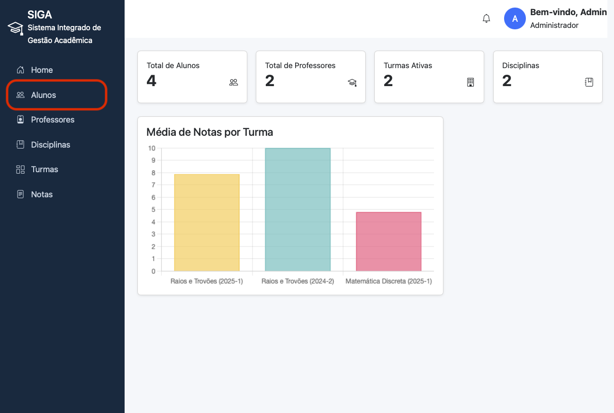
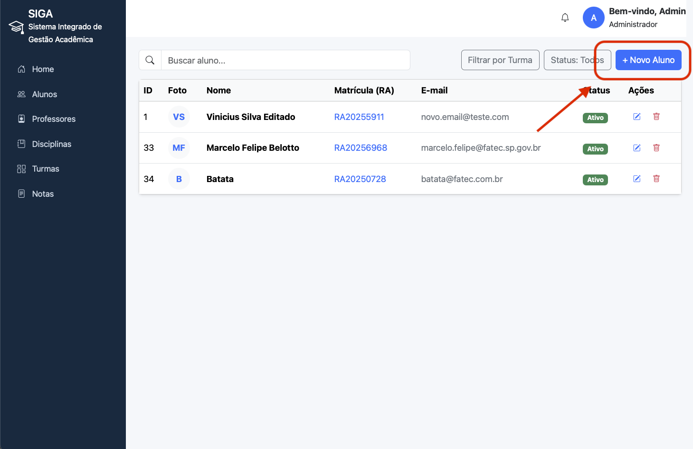
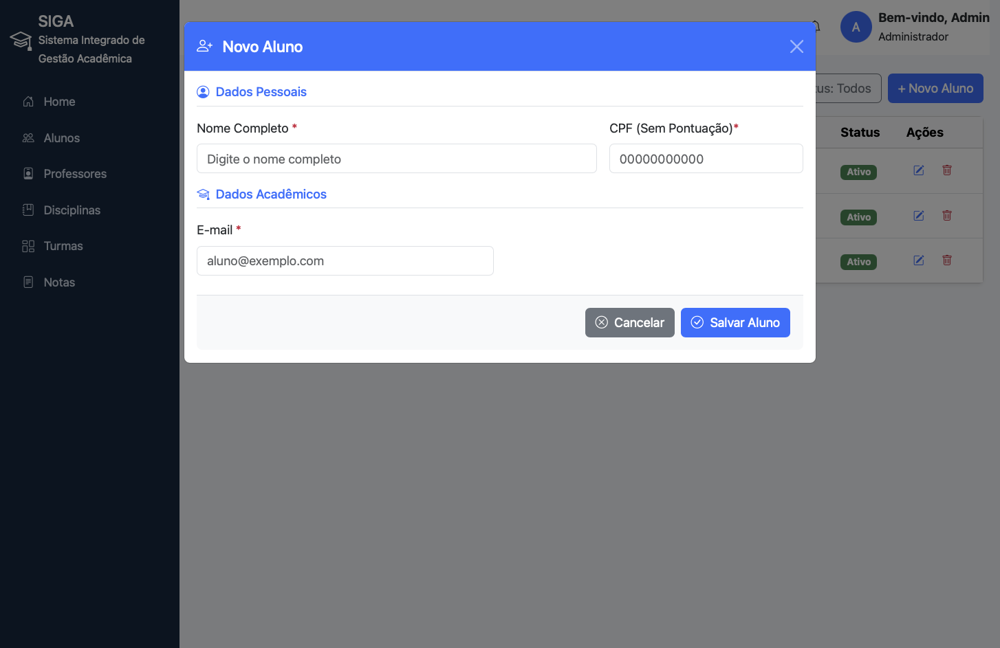
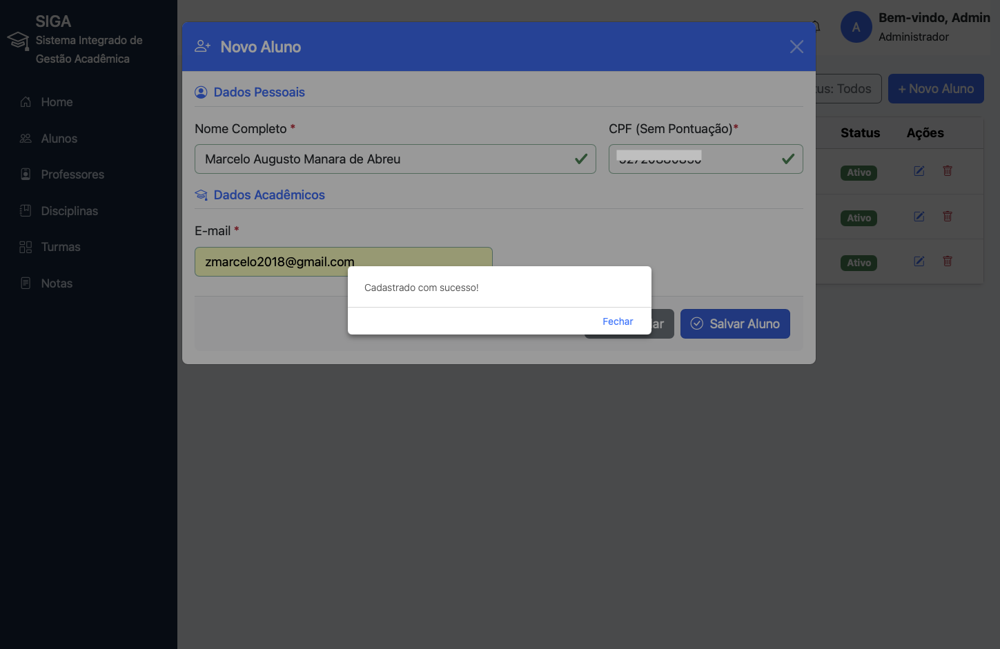
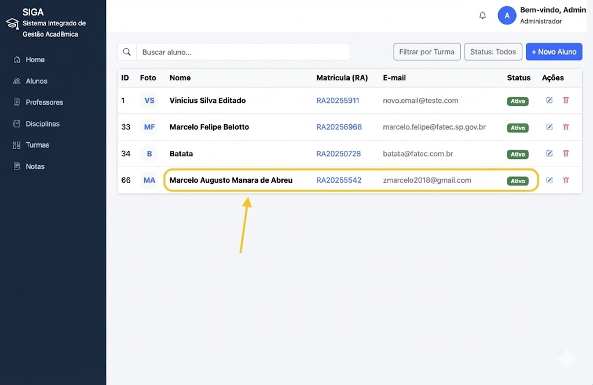

# SIGA - Integrated Academic Management System 📚
   

> **Course:** Object-Oriented Programming (OOP)  
> **Theme:** RESTful Application with Spring Boot  
> **Professor:** Marcos Roberto de Moraes (Maromo)

**SIGA** is a **Fullstack** web application (Backend API + Frontend Thymeleaf) developed for school management. The system implements a **complete RESTful API**, covering CRUD operations for multiple entities (Students, Teachers, Classes, Subjects, and Grades).

---
## 👨‍💻 Development Team
[Lucas Vieira](https://github.com/Lucas-WBB) • [Marcelo Belloto](https://github.com/marcelo-belotto) • [Marcelo Manara](https://github.com/ManaraMarcelo) • [Vinícius Emanuel](https://github.com/vinicius-emanuelds)

---

## 🎯 Project Objectives

- **RESTful API:** Implementation following best practices and HTTP verbs.
- **Complete CRUD:** Integral management of academic entities.
- **Automatic Documentation:** Integrated Swagger/OpenAPI for testing and visualization.
- **MVC Architecture:** Clear separation between Model, View, and Controller.

---

## 🚀 Technologies Used

- **Java 21 (LTS)**
- **Spring Boot 3**
  - Spring Web  
  - Spring Data JPA  
  - Thymeleaf  
  - Validation
- **Frontend:** Thymeleaf + Bootstrap (via CDN)
- **Database:** H2 Database (File Mode)
- **Documentation:** SpringDoc OpenAPI (Swagger UI)
- **Build Tool:** Maven (Dependencies managed via `pom.xml`)

---
## 🛠️ Installation and Execution

### Prerequisites

- **JDK 21 installed** (Required)
- **Git** (to clone the repository)
- **Dependencies:** This project uses **Maven**. You **don't** need to install it manually; the project includes the **Maven Wrapper (mvnw)**.

> [!NOTE]
> All project dependencies (Spring, H2, Lombok, etc.) are defined in the [pom.xml](pom.xml) file. Maven will download them automatically when you first run the project. There is no `requirements.txt` as this is a Java project.

### ▶️ Step-by-Step

#### 1. Clone the Repository

```sh
git clone https://github.com/ManaraMarcelo/SIGA_Academic_System.git
cd SIGA_Academic_System
```

#### 2. Run the Application

From the project root directory in your terminal:

**Windows:**
```sh
./mvnw.cmd spring-boot:run
```

**Linux / Mac:**
First, ensure the wrapper has execution permissions:
```sh
chmod +x mvnw
./mvnw spring-boot:run
```

#### 3. Access

- **Web System:** http://localhost:8080
- **Swagger UI:** http://localhost:8080/swagger-ui/index.html
- **H2 Console:** http://localhost:8080/h2-console

---

## 📚 API Structure (Endpoints)

The API provides resources for managing main school entities. Below is a summary of the available endpoints. For full details, refer to the Swagger documentation.

| Method | Endpoint                     | Description                           |
|--------|------------------------------|---------------------------------------|
| GET    | `/api/alunos`                | List all students                     |
| POST   | `/api/alunos`                | Register a new student                |
| GET    | `/api/professores`           | List all teachers                     |
| POST   | `/api/professores`           | Register a new teacher                |
| GET    | `/api/disciplinas`           | List all subjects                     |
| POST   | `/api/disciplinas`           | Register a new subject                |
| GET    | `/api/turmas`                | List available classes                |
| POST   | `/api/turmas`                | Create a class (Teacher/Subject link) |
| GET    | `/api/matriculas`            | List all enrollments                  |
| PUT    | `/api/matriculas/{id}/notas` | Update a student's grades             |

> ⚠️ Tip: To test requests (POST, PUT, DELETE) directly, use the Swagger UI interface.

---

# 🗄️ Database Configuration (H2)

To fulfill the persistence requirement without complicating the development environment, we use H2 in file mode.

- **URL JDBC:** `jdbc:h2:file:./dados/sigaDB`
- **User:** `sa`
- **Password:** `(empty)`

> [!TIP]
> The database file will be created in the `/dados` folder after the first execution.

---

# 📂 Project Architecture

The folder structure follows Spring Boot best practices:
```sh
com.poo.siga  
├── config/       # Configurations (OpenAPI, CORS)
├── controller/   # REST Layer (Handles HTTP requests)
├── model/        # JPA Entities (Database Mapping)
├── repository/   # Data Access Interfaces (Spring Data)
└── SigaApplication.java
```

---

# 📖 User Manual - SIGA
<details> <summary><strong>Click to expand Full Manual</strong></summary>

Welcome to **SIGA (Integrated Academic Management System)**.  
This manual will guide you through the main features of the system, from basic registration to grade entry.

---

## 1. Accessing the System

Open your preferred browser (Chrome, Firefox, Edge) and type:

🔗 **http://localhost:8080**

You will see the **Home Page (Dashboard)**, which serves as the main menu.

---

## 2. Recommended Registration Order

To ensure data integrity, we recommend following this order:

1. **Teachers** – (Who teaches?)  
2. **Subjects** – (What is being taught?)  
3. **Classes** – (Where and when?)  
4. **Students** – (Who studies?)  
5. **Grades** – (Performance evaluation)  

---

## 3. Managing Teachers

Access the **Teachers** menu in the navigation bar.

### 3.1. Register New Teacher

1. Click on **"New Teacher"**.  
2. Fill in the form with:
   - **Name:** Full name  
   - **Email:** Contact address (e.g., prod.carlos@school.com)  
   - **CPF:** Valid document ID
3. Click **Save**.

### 3.2. Edit or Delete

- **Edit:** Click the pencil icon next to the name.  
- **Delete:** Click the trash can icon.  
⚠ **Warning:** Teachers linked to active classes cannot be deleted.

---

## 4. Managing Subjects

Access the **Subjects** menu.

### 4.1. Create Subject

1. Click on **"New Subject"**.  
2. Enter:
   - **Description:** Subject name (e.g., Basic Mathematics)  
   - **Code:** Internal code (e.g., MAT-101)  
   - **Credits:** Workload or weight (e.g., 4)
3. Confirm the operation.

---

## 5. Managing Classes

Access the **Classes** menu. This stage connects teachers and subjects.

### 5.1. Open Class

1. Click on **"New Class"**.  
2. Select:
   - **Semester:** (e.g., 2024-1)  
   - **Teacher:** A teacher already registered  
   - **Subject:** The desired subject
3. Save.

---

## 6. Managing Students

Access the **Students** menu.

### 6.1. Enroll New Student

1. Click on **"New Student"**.  
2. Fill in:
   - Name  
   - Email  
   - CPF  
   - Enrollment Number (e.g., 20240001)
3. Save the record.

---

## 7. Grade Entry

Access the **Grades** menu in the sidebar. This screen is used to record student assessment performance.

### 7.1. Register P1, P2, and P3

1. Locate the student and class in the list.  
2. Click on **"Enter Grades"**.  
3. Fill in:
   - **P1:** First exam grade (0–10)  
   - **P2:** Second exam grade (0–10)  
   - **P3:** Third exam or extra activity grade (0–10)
4. Click **Save/Update**.

The system will automatically calculate the **Average** and update the **Status** (Passed/Failed).

---

## 8. Troubleshooting

### ❌ Error when deleting
Check if the item (Teacher or Subject) is linked to a Class or Enrollment.

### ⚠ System doesn't load
Confirm that the backend is running and that port **8080** is free.

---

# 📂 Student Registration Example

1. Home page, select `Students` on the left.


2. Click the red-marked area to add a new student.


3. Fill in personal data in the modal.


4. Success message displayed.


5. New student available in the list.


---

## 👨‍💻 Technical Support

For advanced questions, contact the development team:
[Lucas Vieira](https://github.com/Lucas-WBB) • [Marcelo Belloto](https://github.com/marcelo-belotto) • [Marcelo Manara](https://github.com/ManaraMarcelo) • [Vinícius Emanuel](https://github.com/vinicius-emanuelds)

</details>

---

# 📝 Project Backlog (Implementation History)

| ID   | Task                                                                      | Module       | Priority | Status        |
|------|---------------------------------------------------------------------------|--------------|------------|---------------|
| B01  | Scoping, requirements, and MVC architecture                              | Planning     | High       | Completed     |
| B02  | Data model specification (Student, Teacher, Class, Subject, Enrollment)   | Planning     | High       | Completed     |
| B03  | Create Spring Boot project and configure dependencies (JPA, Web, H2)      | Setup        | High       | Completed     |
| B04  | Create Student entity and StudentRepository                               | Student      | High       | Completed     |
| B05  | Implement StudentController (Full CRUD)                                   | Student      | High       | Completed     |
| B06  | Implement Academic History functionality (JSON)                           | Student      | Medium     | Completed     |
| B07  | Create Teacher entity and TeacherRepository                               | Teacher      | Medium     | Completed     |
| B08  | Implement TeacherController (Full CRUD)                                   | Teacher      | Medium     | Completed     |
| B09  | Create Subject entity and SubjectRepository                               | Subject      | Medium     | Completed     |
| B10  | Implement SubjectController (Full CRUD)                                   | Subject      | Medium     | Completed     |
| B11  | Create Class entity and ClassRepository                                   | Class        | High       | Completed     |
| B12  | Implement ClassController (Teacher + Subject link)                        | Class        | High       | Completed     |
| B13  | Create Enrollment entity (Student + Class) and Repository                 | Enrollment   | High       | Completed     |
| B14  | Implement Enrollment endpoint (Create link)                               | Enrollment   | High       | Completed     |
| B15  | Implement Grade Entry (P1, P2, P3) and average calculation                | Grades       | High       | Completed     |
| B16  | Develop Frontend views (Thymeleaf Home and Registration)                  | Frontend     | Medium     | Completed     |
| B17  | Configure Automatic Documentation (Swagger UI)                            | Infra        | High       | Completed     |
| B18  | Configure file data persistence (H2)                                      | Infra        | High       | Completed     |

---

## 🙏 Acknowledgements
This project is the result of teamwork and continuous learning. Thanks to:
* **Prof. Maromo:** For technical mentorship and for challenging us every class.
* **Development Team:** For the partnership in integrating Backend (Spring Boot) and Frontend, overcoming technical challenges together.

## 2025